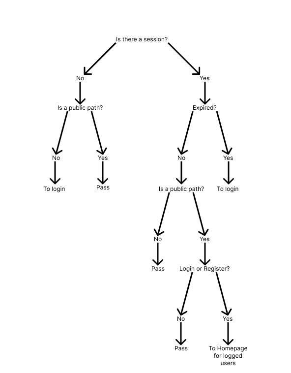

# Authz

## Introduction

This is a guide on how to install Authz. Keep in mind that Authz is not a library, is just a set of steps to set up you own session manager.

Right now is on baby steps and the Idea is to updated it and make it bertter ans safer.

I started with Next 13 using app router, however, with time I want to use the pages router, as well make it available for Vite, astro and React as well. However since nothing is installed you can use this as a beggining point

## Guide

### What will be used?

I'll be using the following tools:

-   [Next 13 with app router.](https://nextjs.org/docs/getting-started/installation)
-   [Typescript](https://www.typescriptlang.org/docs/)
-   [Prisma](https://www.prisma.io/docs/guides)
-   [Zod](https://zod.dev/)
-   [bcryptjs](https://github.com/dcodeIO/bcrypt.js)
-   [jsonwebtoken](https://github.com/auth0/node-jsonwebtoken)
-   [axios](https://axios-http.com/docs/intro)
-   [React Hook Form](https://react-hook-form.com/get-started)

For styling I'll be using:

-   [Tailwind](https://tailwindcss.com/docs/installation)
-   [Shadcn/ui](https://ui.shadcn.com/docs/installation/next)

The case of Shadcn/ui it's special since this is not package, but uses [Radix ui](https://www.radix-ui.com/themes/docs/overview/getting-started), [Class Variance Authority](https://cva.style/docs/getting-started/installation), [clsx](https://github.com/lukeed/clsx) and [Lucide React](https://lucide.dev/guide/packages/lucide-react).

Keep in mind that for styling you can choose to use other options, I use shadcn/ui for practicity.

### Set up

In this project I'll be using [Bun](https://bun.sh/docs) to speedup some process. The first part can be found directly in the [Shadcn/ui](https://ui.shadcn.com/docs/installation/next) documentation, but I add it here for simplicity.

Create your project:

```console
bunx --bun create-next-app@latest my-app --typescript --tailwind --eslint
```

Remember to change the project name from my-app you the name of your project.

Just hit enter untill it's done the set up.

Run the shadcn-ui init command to setup your project:

```
bunx --bun shadcn-ui@latest init
```

You'll be asked this, just select the answers I put:

```
Would you like to use TypeScript (recommended)? yes
Which style would you like to use? › Default
Which color would you like to use as base color? › Slate
Where is your global CSS file? › › app/globals.css
Do you want to use CSS variables for colors? › yes
Where is your tailwind.config.js located? › tailwind.config.ts
Configure the import alias for components: › @/components
Configure the import alias for utils: › @/lib/utils
Are you using React Server Components? › yes
```

Now it's set up. also you can use dark mode, just follow [this guide](https://ui.shadcn.com/docs/dark-mode/next).

Now install prisma:

```
bun install prisma --save-dev
```

and set up Prisma with the init command of the Prisma CLI:

```
bunx prisma init
```

This by default will create prisma folder with the schema.prisma file wiht this:

```prisma
generator client {
  provider = "prisma-client-js"
}

datasource db {
  provider = "postgresql"
  url      = env("DATABASE_URL")
}
```

Below that, add the model for the user and the sessions:

```prisma
model User {
  id        String    @id @default(uuid())
  email     String    @unique
  name      String
  password  String
  createdAt DateTime  @default(now())
  updatedAt DateTime  @updatedAt
  sessions  Session[]
}

model Session {
  id        String   @id @default(uuid())
  token     String   @unique
  createdAt DateTime @default(now())
  updatedAt DateTime @updatedAt
  userId    String
  user      User     @relation(fields: [userId], references: [id])
}
```

and a .env file with this:

```
# Environment variables declared in this file are automatically made available to Prisma.
# See the documentation for more detail: https://pris.ly/d/prisma-schema#accessing-environment-variables-from-the-schema

# Prisma supports the native connection string format for PostgreSQL, MySQL, SQLite, SQL Server, MongoDB and CockroachDB.
# See the documentation for all the connection string options: https://pris.ly/d/connection-strings

DATABASE_URL=""
```

Create a database and get the database URL and put it in the .env file.

Now run in the terminal:

```
bunx prisma generate
```

or

```
bunx prisma migrate dev --name init
```

Since this is not a tutorial on prisma I won't explain the difference, but you can read the documentation.

You'll have a lib folder, inside that folder you'll see a file named utils.ts, we'll create 3 more files.

Create a file named `db.ts` and add this:

```typescript
import { PrismaClient } from "@prisma/client";

declare global {
    var prisma: PrismaClient | undefined;
}

export const db = globalThis.prisma || new PrismaClient();

if (process.env.NODE_ENV !== "production") globalThis.prisma = db;
```

With this you'll be able to make calls to your database.

Now install JWT:

```
bun i jsonwebtoken
```

Createa file named `init-user.ts` and add the following:

```typescript
import { db } from "./db";
import { cookies } from "next/headers";
import jwt from "jsonwebtoken";

export const initUser = async () => {
    const cookie = cookies();
    const session = cookie.get("token-authz");
    if (!session) return null;
    const { id } = jwt.decode(session.value) as {
        id: string;
    };
    const user = await db.user.findUnique({
        where: {
            id: id,
        },
    });
    return user;
};
```

With this you will be able to get the user

Install now `bcryptjs`

```
bun i bcryptjs
```

Create the `hashing.ts` file and add:

```typescript
import * as bcrypt from "bcryptjs";

export const hashPassword = async (password: string) => {
    const hashedPassword = await bcrypt.hash(password, 10);
    return hashedPassword;
};

export const comparePassword = async (
    password: string,
    hashedPassword: string
) => {
    const isMatch = await bcrypt.compare(password, hashedPassword);
    return isMatch;
};
```

This will allow you to hash passwords when an user is registering and compare them if the user is loggin in.

with this, now you have all set up to start.

First, I'll guide you in the process that I made to verify an account.



Basically we need a function that runs on every load before something is rendered in the screen.

In next js we'll use the middleware.ts

```typescript
import { NextResponse } from "next/server";
import type { NextRequest } from "next/server";
import { cookies } from "next/headers";
import jwt from "jsonwebtoken";

export default async function authMiddleware(request: NextRequest) {
    const publicPaths = [
        "/home",
        "/login",
        "/register",
        "/api/auth/login",
        "/api/auth/register",
    ];
    const cookie = cookies();
    const session = cookie.get("token-authz");
    const isPublicPath = publicPaths.includes(request.nextUrl.pathname);
    const path = request.nextUrl.pathname;
    if (session) {
        const { exp } = jwt.decode(session.value) as {
            exp: number;
        if (Date.now() >= exp * 1000) {
            cookie.delete("token-authz");
            return NextResponse.redirect(new URL("/login", request.url));
        } else {
            if (isPublicPath) {
                if (path === "/login" || path === "/register") {
                    return NextResponse.redirect(
                        new URL("/dashboard", request.url)
                    );
                } else {
                    return NextResponse.next();
                }
            } else {
                return NextResponse.next();
            }
        }
    } else {
        if (isPublicPath) {
            return NextResponse.next();
        } else {
            return NextResponse.redirect(new URL("/login", request.url));
        }
    }
}
export const config = {
    matcher: ["/((?!.+\\.[\\w]+$|_next).*)", "/", "/(api|trpc)(.*)"],
};

```
